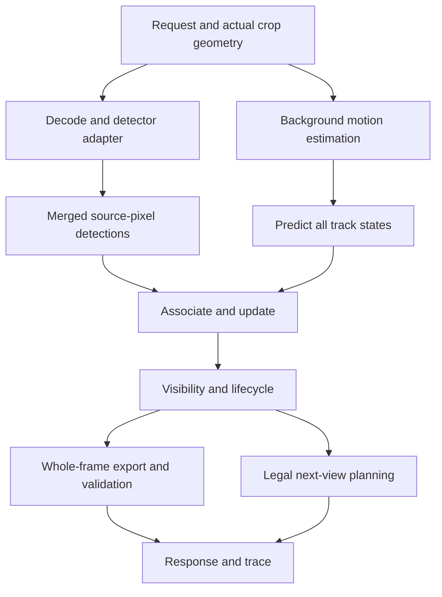
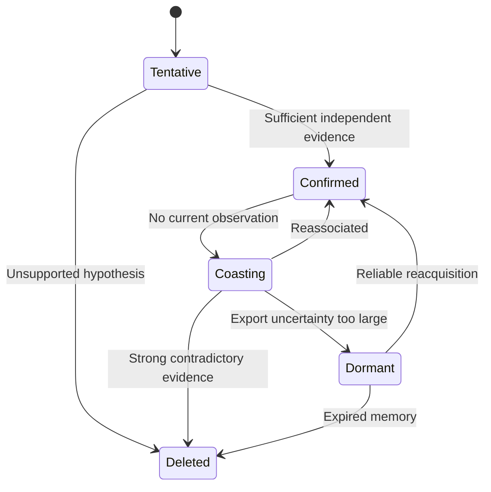

# Drone Flyby: complete tracking pipeline above a trained detector

**Design specification — 20 September 2026**  
**Input assumption:** a working detector checkpoint, such as `yolo.pt`, already fine-tuned for the challenge's 16 classes.  
**Scope:** inference integration, camera-motion estimation, multi-object tracking, memory outside the observed crop, active camera control, safe output, logging, and evaluation. This document specifies a proposed system; it does not claim that all components are implemented in the existing repository.

## 1. Objective and the meaning of an ideal score

Build a causal online system that returns the correct class and current bounding box for every target in the **entire current source frame**, even though only one camera crop is observed. Optimize the official AP50 score and frame delivery, rather than track-ID metrics alone.

A strong detector is necessary but insufficient. The system must discover targets, transport their locations between moving source frames, maintain them while looking elsewhere, remove unsupported hypotheses, and choose informative future views.

A sufficient ideal condition for AP50 = 1 is that every scored frame receives exactly one valid, correctly classified box with IoU at least 0.50 for every annotated object, with no false positives, duplicate outputs, missed frames, or rejected responses. This is a sufficient construction, not a statement that every low-ranked false positive necessarily prevents AP = 1 under interpolated COCO AP. The exact evaluator remains authoritative.

That ideal requires information the camera may not supply. If an object first appears outside the current crop and was never previously observed, its class and location generally cannot be known causally. Discovering it later cannot repair an already scored response. Likewise, a tiny unresolved L0 target cannot be recovered by simply enlarging pixels. Perfect camera scheduling cannot guarantee instantaneous discovery everywhere when only one small crop is available.

Therefore, this design targets an ideal under explicit assumptions:

1. Every new target is detectable before or on its first scored appearance, or is already known through a valid prior observation within the same attempt.
2. Camera motion and target motion can be estimated accurately enough between observations.
3. Localization uncertainty stays within the AP50 tolerance until a useful revisit is possible.
4. Classes and object extents remain inferable through the available views.
5. Every frame is received and answered on time with a valid payload.
6. There is no unresolvable occlusion or identity ambiguity that changes which boxes should be emitted.

No tracking implementation can promise 0.80 or 1.00 from the detector assumption alone. The value of the ideal specification is to make each source of lost score explicit and testable.

## 2. Challenge contract that drives the design

The following facts come from the supplied official repository README and protocol files inspected for this project. Recheck the organizer's current files before final deployment: the live GitHub page could not be fetched during preparation of this document. [Official Drone Flyby repository](https://github.com/amboltio/Nordic-AI-Cup-2026/tree/main/drone-flyby).

| Property | Contract | Consequence |
|---|---|---|
| Source frame | 3840 × 2160 | Maintain tracking geometry in source pixels |
| Received image | Always 960 × 540 | Image dimensions alone do not identify zoom |
| L0 footprint | 3840 × 2160 | Full coverage, reduced detail |
| L1 footprint | 1920 × 1080 | Quarter-frame coverage |
| L2 footprint | 960 × 540 | Sixteenth-frame coverage, native source resolution |
| Output scope | Entire current source frame | Preserve objects outside the current crop |
| Score | COCO mAP at IoU 0.50, macro-averaged over represented classes | Correct class, localization, recall and ranking matter |
| Frame emission | Approximately every 333 ms | End-to-end latency must avoid skipped frames |
| Request timeout | 3333 ms | A timeout budget is not a frame-throughput target |
| Missing frames | Scored with no detections | Tracking cannot submit results retroactively |
| Response annotations | At most 500 | Merge duplicate hypotheses before serialization |
| Camera moves | One command per response, constrained by request | Optimize a legal future view |
| Identity fields | Echo `request_id` and `frame` | Never return predictions for a different frame |
| Validation / final evaluation | Supplied README: 249 / 250 frames | Use actual metadata when counting delivery |

The 25 local reference frames are consecutive views of one scene, with one instance per class in that supplied scene. They do not establish one-instance-per-class constraints for unseen scenes. Multiple tracks may legitimately have the same class.

The source image is not a fixed geographic map. A stationary tower moves in source-image coordinates when the drone moves. A change of crop centre is also not a measurement of physical drone translation.

## 3. System architecture



Keep the detector behind a narrow interface. It provides view-pixel boxes, class evidence, confidence, and observation-quality metadata. The tracker must not depend on a particular YOLO release or checkpoint filename.

Use one serialized state owner per sequence. Independent requests must never mutate the same track bank concurrently. Detector batching within a request is compatible with serialized sequence updates.

### Suggested modules

| Module | Responsibility |
|---|---|
| `detector_adapter` | Model loading, preprocessing inversion, tile merging and class mapping |
| `geometry` | View/source transforms, box corner warping, clipping and coordinate tests |
| `motion_estimator` | Background correspondence, robust transform fitting and quality estimates |
| `track_filter` | State prediction, covariance transport and measurement update |
| `association` | Gating, assignment, low-confidence recovery and reacquisition |
| `track_lifecycle` | Birth, confirmation, coasting, negative evidence, dormancy and deletion |
| `scene_memory` | Keyframes, transform links, coverage age and discovery candidates |
| `camera_policy` | Candidate generation, constrained planning and command validation |
| `exporter` | Current-frame box selection, confidence ranking and duplicate suppression |
| `session_manager` | Sequence isolation, request idempotency, reset and bounded caches |
| `trace_writer` | Separate detector/state/timing streams |
| `evaluator` | Fixed-view replay, causal oracle experiments and realtime evaluation |

These are responsibilities, not a requirement to replace every existing file. Introduce them behind the current request/response contract and preserve the best detector/tracker configuration as a baseline.

## 4. Detector interface and coordinate correctness

### 4.1 Detector output

For each merged observation retain:

- View-pixel `xyxy` box before conversion to source coordinates.
- Source-pixel `xyxy` box after conversion.
- Class ID mapped through the checkpoint's actual class names to `dtos.OBJECT_CLASSES`.
- Detection score; optionally full class probabilities if genuinely available.
- Resolution level, tile ID/support, crop-edge truncation, effective object size and frame identity.
- Optional appearance descriptor extracted from the current observation.

If the detector provides only the top class and score, do not pretend the score is a complete class posterior. Keep separate evidence fields and use a documented class-voting approximation.

### 4.2 Coordinate chain

Let the received crop's source region be `[a, b, c, d]`, and its transmitted dimensions be `Wv × Hv`. For a point in received-image pixels:

\[
x_s=a+x_v(c-a)/W_v,\qquad y_s=b+y_v(d-b)/H_v.
\]

For homogeneous coordinates, define:

\[
T_t=\begin{bmatrix}(c-a)/W_v&0&a\\0&(d-b)/H_v&b\\0&0&1\end{bmatrix}.
\]

Apply this transformation to both corners of an axis-aligned view box. Normalize only at the response boundary:

\[
x_g=x_s/W_s,\qquad y_g=y_s/H_s.
\]

Always use the request's **actual** `source_region_xyxy`. Do not reconstruct it from the last camera command: that command may have been rejected.

For tiled inference, the complete chain is:

1. Undo model-input letterboxing or resizing, unless the detection library already returned original tile coordinates.
2. Convert tile coordinates into received-image coordinates using the tile origin and any tile resize transform.
3. Merge duplicate tile detections in that common received-image system.
4. Convert through `T_t` to source pixels.
5. Normalize only when exporting.

Never undo preprocessing twice. Preserve the crop aspect ratio when resizing; padding is preferable to stretching. Extra tiles provide scale/context changes but not missing source detail.

### 4.3 Measurement quality

A box measured at L0 typically has coarser source-pixel uncertainty than the same view-pixel error at L2. With image-to-source scale matrix `S`, propagate measurement covariance as `R_source = S R_view Sᵀ` for centre coordinates, with the corresponding Jacobian for the full box state.

Estimate uncertainty from held-out residuals where possible. Increase it for small boxes, low-quality detections and truncated objects. A high class confidence is not proof of accurate box edges.

Treat an edge-truncated crop box as a partial observation. Do not automatically shrink a previously complete track to the visible fragment. Update only trustworthy geometry or inflate uncertainty for affected dimensions. Validate that truncation handling matches the organizer's annotation convention.

## 5. Estimating camera motion across changing views

This is the main difference from a conventional fixed-camera tracker.

### 5.1 Estimate source-frame motion, not raw crop displacement

Find background correspondences between the current crop and a previous crop or a suitable cached keyframe. Lift matched points through their own view-to-source transforms before fitting motion. Mask target regions when feasible so moving objects do not determine the background transform.

Alternatively, if a transform `G` maps previous-view pixels to current-view pixels, then:

\[
H_{t\leftarrow k}=T_t\,G_{t\leftarrow k}\,T_k^{-1}.
\]

This maps source pixels at frame `k` to source pixels at frame `t`. Its direction must be tested explicitly. Simply applying crop-centre displacement to every track is incorrect.

Fit a similarity or affine transform first; use a homography only when it improves robust residuals with adequately distributed inliers. Greater model flexibility can worsen extrapolation outside the observed crop.

### 5.2 Quality assessment

Record inlier count, inlier fraction, residual distribution, spatial coverage, transform conditioning, plausible scale/rotation, and forward/backward consistency. Reject fits supported by a tiny patch or a single repeated texture even if their residual is small.

A good fit inside one L2 crop does not prove accuracy over the whole 4K frame. Add uncertainty for extrapolation distance and poor scene coverage. Terrain relief and tall structures create parallax, so a single ground-plane homography may not accurately transport aircraft or tower tops. Prefer local validated corrections near tracks where sufficient evidence exists.

### 5.3 Little overlap or failed registration

Use the following fallback sequence:

1. Match a recent overlapping keyframe at compatible scale.
2. Use a short-horizon camera-motion prediction learned from recent accepted transforms, with rapidly growing covariance.
3. Request an informative wider view through legal level transitions.
4. Suppress exports whose current localization is no longer credible; retain their dormant identity separately.

Do not interpret identity transform as certainty when registration fails. A low-uncertainty identity fallback can create many confidently misplaced boxes.

Cache a bounded number of timestamped keyframes, descriptors, source footprints and transform links. A stitched image may help visualization or matching, but old pixels are not current observations and must not generate repeated detector evidence.

## 6. Track state and motion filtering

### 6.1 State representation

A practical initial state in current source-pixel coordinates is:

\[
\mathbf{x}=[c_x,c_y,v_x,v_y,\log w,\log h]^T.
\]

Velocity represents residual object motion after background compensation, not the raw displacement caused by the drone. Add size velocities only if evidence justifies the additional uncertainty and complexity.

Every track should also contain:

| Field | Purpose |
|---|---|
| Stable internal ID | Association and visualization; not sent as an extra response field |
| State and covariance | Location, residual velocity, size and uncertainty |
| Class evidence vector | Temporally aggregated class support |
| Existence probability | Belief that the hypothesis represents a real target |
| Status | Tentative, confirmed, coasting, dormant, deleted |
| First/last observation times | Physical age and observation freshness |
| Last trusted transform/frame | Prevent applying motion twice |
| Hit and informative-miss history | Confirmation and rejection |
| Appearance templates | Optional reacquisition support |
| Last full box and truncation flags | Avoid corruption by clipped observations |
| Last export score/reason | Explain emitted or withheld predictions |
| Motion mode evidence | Static-background versus independently moving |

### 6.2 Prediction

Advance time using source-frame timing, not the number of requests received. When source frames are uniformly spaced and frame numbers represent capture order, `Δt = (frame_t - frame_k) × frame_interval_ms / 1000`. Verify that convention from metadata; `frame_index` primarily diagnoses delivery gaps. Wall-clock processing time is a separate quantity.

Implement prediction as a documented nonlinear function `f(x, H, Δt)`:

- Transport the previous box corners through the camera transform.
- Rebuild a current axis-aligned envelope.
- Transport residual velocity into the current coordinate basis using the local transform Jacobian.
- Apply residual motion for the elapsed time according to the chosen convention.
- Propagate covariance through the same state transformation.

\[
P_t^- = J_xP_kJ_x^T+Q_{object}+J_H\Sigma_HJ_H^T+Q_{model}.
\]

The last terms account for transform estimation error and imperfect scene/motion assumptions. A calibrated approximation is acceptable initially; omitting camera uncertainty entirely is not.

Repeatedly warping axis-aligned envelopes can inflate boxes. Where useful, preserve corners or a last measured box plus composed transform, and reset from reliable detections. Do not let numerical envelope growth become permanent object growth.

### 6.3 Static and moving hypotheses

Begin with a conservative background-stationary model and allow residual motion when supported by repeated innovations. A vehicle class does not prove movement; a building class is useful prior information but not a substitute for checking model residuals.

An optional interacting multiple-model filter can maintain stationary and constant-velocity hypotheses. Start with a simpler filter if it already explains measured trajectories; added complexity should resolve an observed failure.

Fresh high-quality measurements should correct the track promptly. Do not smooth so aggressively that output boxes visibly lag current objects.

## 7. Association and class consistency

Use one-to-one assignment with explicit unmatched choices. For each predicted track and detection, combine normalized terms such as:

\[
C_{ij}=\lambda_m d^2_{Mahalanobis}+\lambda_b(1-IoU)+\lambda_c C_{class}+\lambda_a C_{appearance}.
\]

Gate impossible pairs before assignment. Normalize or bound terms so their weights have interpretable effects. Motion covariance controls the spatial gate; a failed motion estimate must not silently permit arbitrary identity swaps.

Use class compatibility softly for uncertain tracks and more strongly for well-supported tracks. A transient top-class error should not automatically create a second track beside the first. Conversely, two separate same-class objects must remain separate.

A useful two-stage pattern is to associate reliable detections first, then let weaker detections recover unmatched established tracks under tighter geometry/appearance checks. Low-score background detections should not freely create new tracks. This follows the general recovery principle of [ByteTrack](https://arxiv.org/abs/2110.06864); its pedestrian benchmark settings are not challenge-specific defaults.

Appearance descriptors are optional tie-breakers for ambiguous crossings or reacquisition. Background-dominated tiny patches can be misleading. Store diverse, high-quality observations and update templates only after confident matches. Motion, appearance and camera compensation are complementary, as illustrated by [BoT-SORT](https://arxiv.org/abs/2206.14651), but this challenge additionally requires crop-aware visibility and whole-frame export.

For class aggregation, use quality-weighted evidence with decay or capped effective sample count. Consecutive views and overlapping tiles are correlated: ten near-identical observations should not act like ten independent proofs. Permit class correction when new high-resolution evidence consistently contradicts an earlier guess.

## 8. Track lifecycle and negative evidence



Birth confirmation and output permission are separate decisions. A clean first-frame high-confidence detection can be exported immediately while its persistent identity remains tentative. Otherwise mandatory multi-frame confirmation would lose early recall even with an ideal detector.

### 8.1 A missing detection is informative only when the target was observable

Estimate `p_observe` from the predicted box distribution, actual crop, scale-dependent detector recall, image quality, likely occlusion and edge truncation. The entire uncertainty region matters, not just its centre.

| Situation | Appropriate interpretation |
|---|---|
| Predicted object outside current crop | Unobserved; no detector-miss penalty |
| Partially inside crop or near an edge | Weak negative evidence at most |
| Tiny in L0 | Miss may be expected; reduce penalty |
| Clear, well-resolved inside L2 | Miss is stronger contradictory evidence |
| Registration unreliable | Expected location may be wrong; avoid strong rejection |
| Detector failed on the frame | No valid detection opportunity |
| Object left the source frame | Do not export it in this frame |

This directly addresses the proposal to delete tracks after revisiting L2: a clean revisit can strongly reduce confidence, but one empty detection is not universal proof that the object never existed.

### 8.2 Existence update

A simple illustrative missed-observation model is:

\[
r^- = p_Sr_{previous},\qquad
r^+ = \frac{r^-(1-p_D)}{1-r^-p_D}.
\]

Here `p_D` is the probability of a usable matched detection given that this hypothesis exists under the current observation conditions. This formula assumes a simplified missed-detection likelihood and is not a substitute for a clutter-aware association model. Outside the observed region, take `p_D` near zero; a miss then contributes almost no new evidence. Detections update existence using a target-versus-clutter likelihood or an empirically calibrated approximation, not by setting existence equal to raw YOLO confidence.

Keep separate counters for elapsed time, time since any observation, and informative misses. A fixed rule such as deleting after three unseen requests confuses camera movement with object disappearance.

### 8.3 Prevent persistent false positives

Do not let predictions confirm themselves. Repeated exports, optical-flow propagation and duplicated tiles are not independent detector hits. Require fresh image evidence to improve existence or class certainty. Dormant hypotheses can support reacquisition without appearing in every response.

A practical starting policy is to require repeated compatible observations for persistent low/moderate-confidence births, allow immediate strong detections to export, and suppress stale predictions once localization or existence confidence becomes inadequate. Exact hit counts and timeouts must be chosen from replay, not treated as universal constants.

## 9. Whole-frame export and AP-aware confidence

At each response, consider fresh detections and all current predicted tracks. Outputs must refer to the current source frame, not their last observation frame.

Export only boxes that satisfy all of the following:

1. The hypothesis plausibly corresponds to a target in the current source frame.
2. A supported class is available.
3. The current box has adequate localization reliability.
4. It is not a duplicate of another exported hypothesis.
5. The clipped normalized box is finite and strictly positive in area.

Conceptually rank outputs by:

\[
s \approx P(\text{correct class and IoU}\geq0.5\text{ and target exists}\mid\text{available evidence}).
\]

A practical approximation combines existence, class certainty and localization quality, but their product is not automatically calibrated because these factors are dependent. Calibrate on held-out labeled data when available. Fresh observations, coasting predictions and different resolution levels must have comparable ranking semantics.

Track localization confidence should fall when camera registration is uncertain, elapsed time grows or residual motion is unpredictable. A stationary object's class certainty may remain high while its current box certainty becomes low.

For intuition, two equal-size boxes differing only by horizontal displacement `δ` have `IoU = (w-|δ|)/(w+|δ|)` while they overlap. AP50 therefore requires `|δ| ≤ w/3` in that restricted example. A 12-pixel-wide target tolerates only 4 pixels of horizontal error; combined vertical/size errors reduce the allowance. This motivates uncertainty-driven revisit scheduling rather than one global track lifetime.

Use covariance sampling or held-out error distributions to estimate localization success; the equal-box formula is only an illustration.

### Duplicate handling

Merge tile duplicates before tracking. After tracking, resolve duplicate births and suppress duplicate exports, retaining the best-supported current localization. Never enforce one object per class globally. Avoid broad class-agnostic suppression that removes truly overlapping different objects. When two class hypotheses describe the same physical target, resolve their common identity rather than submitting both indefinitely.

The evaluator does not perform NMS for you. Very low-confidence extras are not free: ranking, detection limits and competition with true predictions still matter. Preserve useful recall without flooding outputs with unsupported stale boxes.

## 10. Active camera policy: discovery, verification and localization refresh

The camera policy should maximize expected future correct detections across the **whole frame**, not simply zoom toward the highest-confidence track.

### 10.1 Maintain discovery memory

Represent observed regions as a coarse source-coordinate grid or timestamped polygons carrying last-observed time, resolution and observation quality. Transport them with camera motion; age or invalidate them when registration is unreliable. New parts of the moving source frame are unexplored.

“No detector output” is not automatically “verified empty.” Empty evidence depends on scale, expected target size and detector reliability. Maintain uncertain candidate regions separately from confirmed tracks.

### 10.2 Generate useful candidate views

Candidates should cover:

- Newly entering and long-unobserved regions.
- Tracks approaching their localization-error budget.
- Ambiguous classes that benefit from higher resolution.
- Suspected false positives that need a clean verification view.
- Clusters where one crop can refresh several tracks.
- Background-rich overlap needed for camera registration.
- A wider view for recovery after failed motion estimation.

Predict where targets will be when the camera command becomes effective. Commands affect future requests, not the response being constructed. If frames are skipped, use expected delay and then reconcile against the actual next request.

### 10.3 Score and plan legal actions

An illustrative candidate utility is:

\[
U(v)=\lambda_n E[\text{new useful detections}]
+\lambda_r E[\text{localization risk reduced}]
+\lambda_c E[\text{class ambiguity reduced}]
+\lambda_f E[\text{false hypotheses resolved}]
-\lambda_d C_{delay}-\lambda_g C_{registration\ risk}.
\]

These are surrogate objectives, not an exact additive decomposition of COCO AP. Select weights using causal replay and inspect how much time the policy spends on discovery versus known objects. Reserve exploration capacity so a dense known cluster does not monopolize the camera. Macro-averaged AP also means a common easy class should not consume every revisit.

A small receding-horizon search over a few legal steps is preferable to elaborate learned control until the tracker and motion model are reliable. Explicitly price the transitions needed to reach L2 or return to L0.

### 10.4 Obey constraints from the request

Enumerate allowed levels and centre bounds from `camera_constraints`; check Euclidean movement limits relative to the current actual centre. Intersect constraints when finding a reachable centre—clamping to bounds after projecting onto a movement circle can make the result illegal again. Round to integers and revalidate the final command.

The supplied protocol permits adjacent level transitions, so L0 ↔ L2 requires L1 in between. The full-view reset exemption concerns movement distance, not permission to skip a level. A rejected command does not mean the camera moved; use feedback and the next actual view to update state.

A useful initial behaviour is wider discovery, targeted L1/L2 confirmation, and risk-triggered refreshes. Do not hardcode a raster sweep as optimal: the scene moves during the sweep and targets can disappear before the camera arrives.

## 11. Causal request-processing pseudocode

```text
ON_REQUEST(request):
    validate request identity and geometry
    acquire sequence-specific state ownership
    if this request_id has a cached response:
        return the cached response without updating state again
    initialize or resolve sequence state
    enforce explicit out-of-order/reset policy; never rewind state silently

    frame_time = derive_source_time(request)
    actual_view = request.view
    record camera feedback; reconcile pending command with actual_view
    image = decode(actual_view.image)

    detections_view = detector(image, actual_view.level)
    detections_view = merge_tiles_and_restore_view_coordinates(detections_view)
    detections_source = map_through_actual_crop(detections_view)
    motion, motion_quality = estimate_background_motion(image, state.keyframes)

    predict all live tracks to frame_time, including those outside actual_view
    propagate camera and target-motion uncertainty
    determine observation opportunities from actual crop and image quality

    associate reliable detections to predicted tracks
    recover eligible unmatched tracks with weaker detections
    update matched tracks, classes and trusted appearance templates
    attempt gated reacquisition of dormant tracks
    create tentative tracks from eligible unmatched detections
    apply informative-miss updates only where observation was credible
    resolve duplicate identities; update lifecycle

    annotations = choose_current_whole_frame_predictions()
    annotations = suppress_duplicates_clip_and_normalize(annotations)
    next_view = plan_and_validate_legal_future_view()
    response = echo_identity_and_assemble(annotations, next_view)
    validate complete response against official DTO and geometry rules

    commit state and cache response atomically
    enqueue immutable raw-detection/state/timing records to bounded logger
    release ownership and return response
```

The logger may be asynchronous, but it must receive snapshots rather than mutable references. Define a full-queue policy: shed optional image logging first and record lost diagnostics; do not allow unbounded memory growth or delay critical responses indefinitely.

On detector failure, a valid prediction-only response may still be useful if track geometry is trusted. On motion failure, widen uncertainty and withhold unsafe predictions. Catch errors without silently treating failures as clean negative observations. Every degraded frame must have an explicit diagnostic reason.

## 12. Timing and deployment on the RTX 5090

Use the available 32 GB VRAM to keep models resident and batch useful tiles, while measuring whether extra inference actually improves detection. More VRAM does not remove network or serialization latency.

Target end-to-end request round trips below the approximately 333 ms emission interval with margin. The 3333 ms timeout only prevents abandonment; a response taking 700 ms can already cost intervening frames. Measure tail latency, not just average GPU inference time.

Warm detector shapes and kernels before accepting an attempt. Use one GPU inference owner or explicitly bounded scheduling, no concurrent training, and bounded CPU thread pools. Measure decode, transfer, detector, motion, association, serialization, logging and round-trip latency separately.

If over budget, reduce optional appearance extraction, keyframe matching or redundant tiles based on measured utility. Do not first remove geometry validation or uncertainty propagation. Any adaptive detector mode must be logged so comparisons remain interpretable.

Never advance predictions to wall-clock response time: the answer is scored against the request's source frame. A late answer still describes that frame.

## 13. Diagnostics and visualization

Keep three distinct records sharing sequence/request/frame identifiers:

| Record | Required information |
|---|---|
| Detector stream | Raw merged detections before tracking, scores, class evidence, tile support, view and source boxes |
| Tracking stream | Predicted/updated states, covariance, associations, residuals, existence/class evidence, status transitions and export decisions |
| Timing/camera stream | Arrival, processing and response-ready times, actual crop, requested crop, feedback, transform quality and frame gaps |

Also record model hashes, resolved configuration, package versions, detector errors, random seeds where relevant, and dropped trace records. Full visualization snapshots are not automatically sufficient to resume the process; resumable checkpoints require caches, pending state and any relevant RNG state too.

The viewer should offer a frame slider and separate toggles for detections, updated tracks, coasting predictions and emitted boxes. Show an actual-crop overlay on a source-frame schematic, camera-centre history, track trails, selected-track uncertainty, informative-miss reasons and counts by state/class. Counts are model hypotheses unless GT is explicitly loaded.

Paths in source-image coordinates are not physical drone or object trajectories. If a stabilized path view is provided, label its coordinate frame, reference keyframe and registration validity. Do not display camera pan centres as GPS flight paths.

Small shareable summaries should include received-frame coverage, internal/prefix/tail gaps when expected bounds are known, p50/p95 latency, transform failure rate, detection counts by level/class, tentative-to-confirmed conversion, informative-miss deletions, and fraction of exports based on prediction only. Ground-truth-free counts diagnose behaviour but do not establish accuracy.

## 14. Evaluation that separates detector, tracker and camera failures

### 14.1 Local correctness tests

- Identity and crop-to-source round trips at every level and boundary.
- Letterbox/tile transformations applied exactly once.
- Synthetic known camera transforms transported in the correct direction.
- Stationary targets remain stationary after background compensation.
- Independent target motion remains after compensation.
- Skipped-frame timing increases prediction uncertainty appropriately.
- Objects outside the crop do not receive informative misses.
- Clean revisits reduce unsupported hypotheses without deleting genuine unobserved objects.
- Partial boxes do not collapse a track's full geometry.
- Duplicate requests do not create extra hits or extra tracks.
- New sequences cannot inherit prior-scene detections.
- Invalid candidate boxes are removed before they can reject the whole response.

These tests verify mathematical/protocol invariants; they are not evidence of hidden-set performance.

### 14.2 Oracle ladder using only local GT

| Experiment | What is supplied | What it diagnoses |
|---|---|---|
| Official full-frame oracle | Current GT directly as output | Scorer and protocol should reach 1.000 |
| Causal visible-crop oracle | Only GT objects observable under a declared current-crop visibility rule | Tracking/camera limitations with ideal local detections |
| Known-motion synthetic test | Controlled transforms and trajectories | Geometry, uncertainty and association implementation |
| Real detector, fixed saved views | Identical images for all tracker variants | Tracking benefit without camera trajectory changes |
| Real detector, active camera | Policy chooses views | Complete decision loop |
| Realtime active camera | Actual timing and frame dropping | Deployable score |

For the crop oracle, explicitly define treatment of partially visible objects and minimum visible fraction. Do not leak full extents, classes or positions from objects outside the observation. Mark any intentionally privileged full-extent oracle separately. No test component may look at future GT when emulating causal deployment.

A visible-crop oracle below 1.0 can be an observability or scheduling result, not necessarily a tracking bug. The official full-frame oracle bypasses those limitations and is only a scorer sanity check.

### 14.3 Score-aware diagnostics

Measure AP50 per class, current-observation versus propagated-box recall, localization error versus time since observation, precision of newly created tracks, duplicate export count, and performance by object size. Compare detector-only output with tracked output on exactly the same view sequence.

Keep local frame splits fixed during algorithm comparisons. With 25 consecutive frames of the same physical objects, a first-20/last-5 split measures temporal transfer within a scene, not independent-object or independent-location generalization. If training augmentations or crops are generated, assign source frames to splits before deriving them. Augmentations do not create new independent target instances.

Preserve T1's measured 0.126 pipeline and exact weight files as the current fallback. The later VisDrone runs scored 0.079 and 0.074; do not silently substitute them as the winning detector. For this specification, whichever checkpoint is selected should be frozen while tracking is evaluated.

## 15. Practical implementation order with limited experiments

Complete local checks before spending a remote validation attempt.

1. **Geometry and motion:** freeze detector and views; verify transforms and out-of-crop transport. Establish an honest uncertainty fallback.
2. **Association and lifecycle:** compare fresh-only predictions with uncertainty-gated propagation; stop self-confirming false positives and apply crop-aware negative evidence.
3. **Active viewing:** change policy only after fixed-view tracking helps. Use discovery coverage plus revisit deadlines rather than confidence chasing.
4. **Realtime verification:** submit the strongest complete candidate, retaining exact config/weights and frame-delivery statistics. Repeat only to resolve a concrete uncertainty.

Do not change the detector, tracker, augmentation and camera schedule together when diagnosing a regression. Remote end-to-end gains determine the competition outcome, but fixed-view tests explain why a candidate changed.

## 16. Acceptance checklist for an ideal implementation

- [ ] Checkpoint classes match the 16 target names; no assumption about pretrained class ordering remains.
- [ ] Every detection is mapped through the actual received crop.
- [ ] Background motion is distinguished from crop motion and target motion.
- [ ] Tracks outside the crop are predicted in the current source frame.
- [ ] Motion and measurement uncertainty govern export and revisits.
- [ ] Missing observations are distinguished from credible negative evidence.
- [ ] Fresh strong detections can contribute without unnecessary confirmation delay.
- [ ] Correlated tiles, repeated frames and prior exports cannot inflate confidence.
- [ ] Multiple same-class targets are supported; duplicate physical hypotheses are suppressed.
- [ ] Every camera command passes current constraints after integer rounding.
- [ ] Every output passes official schema, identity and box validation.
- [ ] No future frame, hidden GT, stale-sequence state or unobserved current-frame information is used.
- [ ] The causal visible-crop oracle and real detector are evaluated separately.
- [ ] Realtime frame delivery is measured through the full deployment path.
- [ ] Best known configuration, code revision and checkpoint hashes are preserved.

**Expected result under the ideal assumptions:** every target remains correctly localized and classified between observations, fresh arrivals are discovered without delay, no false hypotheses are emitted, and every frame receives a valid response. When those assumptions fail, the same design should expose whether the loss arose from discovery, registration, association, lifecycle, localization, class uncertainty or timing—so the next change addresses the actual cause.
