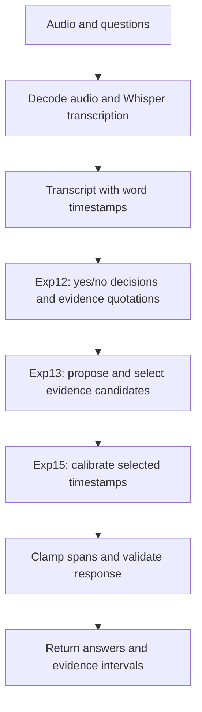

# Medical Appointment — Submission

Nordic AI Cup 2026: Submission by The Winter Soldier

This document describes **Exp15**, the best validated solution in our experiments. It combines speech transcription, language-model evidence extraction and refinement, and a small deterministic timestamp correction. The competition-provided `api.py` remains unchanged.

## Recorded results

| Evaluation | Accuracy | Mean temporal IoU | Final score |
| --- | ---: | ---: | ---: |
| Local live evaluation, 39 conversations / 390 questions | 0.989744 | 0.634262 | 0.776455 |
| Competition validation, reported best Exp15 run | — | — | **0.765** |

The local live run had no failed conversations or timeouts: mean latency **22.48 seconds**, worst **32.05 seconds**, against the 60-second conversation budget. These are recorded results, not guarantees for different hardware or server load. The local dataset was used repeatedly during development; its score is not an independent held-out estimate.

## Solution approach

The task is to answer each question about an audio consultation and, for a positive answer, return the start and end of the supporting passage. Our main bottleneck was evidence localization rather than yes/no classification.

Exp15 uses:

- **Whisper large-v3**, through faster-whisper, for English transcription and word timestamps. The workstation profile uses CUDA and FP16; decoding uses beam size 5, temperature 0, voice activity detection, and no conditioning on previous text.
- **Qwen3.5-27B, Q4_K_M GGUF**, running in a separate CUDA-enabled llama.cpp server, for question answering and evidence selection. Calls use temperature 0, seed 1234, structured JSON output, and thinking disabled.
- **BAAI/bge-small-en-v1.5** for the retained retrieval/fallback infrastructure. It is loaded by the pipeline, although the primary Exp15 evidence path uses the language model.
- Two saved training-example banks to illustrate evidence and boundary conventions. The selection code excludes the current recording/transcript from demonstrations where matching metadata is available.

The language model copies evidence phrases from the transcript instead of generating timestamps. Exact normalized quote matching maps these phrases to ASR word boundaries, reducing invented timestamps and ambiguous text-to-time mappings. No custom Qwen fine-tuning is required.

## High-level pipeline



1. **Receive and decode:** the API forwards the request through `example.py` to a dedicated model worker.
2. **Transcribe:** Whisper produces recognized words and timestamps. Transcript segments receive source identifiers.
3. **Initial evidence extraction (Exp12):** Qwen answers the questions and copies supporting quotations. The resolver anchors quotations to transcript sources and obtains timestamps from the matched words. Bounded repair/fallback paths handle extraction failures.
4. **Evidence refinement (Exp13):** for positive predictions, Qwen proposes core, contextual, and alternative evidence. A second selection step chooses among resolved candidates or keeps the existing evidence. This stage preserves the initial yes/no decisions.
5. **Timestamp calibration (Exp15):** for an ordinary selected interval `[s, e]`, with duration `d = e − s`, apply `s′ = s + 0.10d` and `e′ = e + 0.10 seconds`. The end-fraction correction is zero. The onset adjustment is skipped for intervals of at most 0.03 seconds. Negative answers and missing spans remain unchanged.
6. **Response validation:** clamp intervals to the audio duration, round timestamps, and check the response structure before returning it.

Calibration is applied once to the final selected interval. It improves observed boundary bias; it does not repair wrong occurrences or ASR errors.

## Required submission files

Keep these paths relative to the `medical-appointment/` directory:

| Path | Role |
| --- | --- |
| `api.py` | Competition HTTP transport; unchanged |
| `example.py` | Exposes the prediction function to the API |
| `dtos.py`, `utils.py` | Request/response types, audio helpers, validation |
| Entire `solution/` folder | Pipeline, model worker, ASR, evidence extraction, refinement, calibration, shared imports |
| Entire `configs/` folder | Base/profile/experiment settings and saved calibration settings |
| `models/annotation_bank_exp12.json` | Initial extraction demonstration bank |
| `models/contrast_bank_exp13.json` | Refinement demonstration bank |
| `requirements.txt` | Dependency declarations |
| `requirements-submission-lock.txt` | Snapshot of the working Python environment; generate below |
| `scripts/`, `local_evaluator.py` | Local reproduction and diagnostic tools |
| This README | Approach and operating instructions |

Important implementation files are `solution/pipeline.py`, `solution/asr.py`, `solution/grounding12.py`, `solution/refinement13.py`, `solution/calibration14.py`, `solution/calibration15.py`, `solution/worker_client.py`, and `solution/gpu_worker.py`. Keep the entire folder to preserve their shared dependencies.

**Preserve `configs/calibrated/`:** the pipeline automatically loads the latest file by filename before applying experiment overrides. Removing or adding calibration files can change the effective configuration. Exp15-specific files include `configs/experiments/exp15.yaml`, `configs/exp12_grounding.json`, `configs/exp13_refinement.json`, and `configs/exp15_calibration.json`.

Supply the exact model weights or document their download locations and revisions. Preserve the two JSON demonstration banks even if `models/` is ignored by Git. Full training CSV/audio files are needed for local evaluation, but are not read as ground truth by the normal prediction path.

## Environment and model setup

The recorded live run used the `workstation_32gb` profile on the RTX 5090 workstation. Use the existing working virtual environment and CUDA-enabled llama.cpp build when reproducing it. A CPU-only Torch or llama.cpp installation is not equivalent.

From the project directory, activate your environment (adjust the path if it is elsewhere):

```bash
source .venv/bin/activate
python -m pip freeze > requirements-submission-lock.txt
llama-server --version
nvidia-smi
```

Record the llama.cpp version/build, GPU driver, and actual model file hashes alongside the submission. For a fresh environment, install the same compatible CUDA/PyTorch stack and the saved dependency versions. The original `requirements.txt` contains dependencies from earlier experiments; Exp15's Qwen inference uses the separate `llama-server`, not the old in-process llama-cpp-python verifier.

### Terminal 1: start Qwen

Use the existing working llama.cpp executable. The following command expresses the configuration used for this pipeline; retain your previously working executable path/build if it is not on `PATH`:

```bash
llama-server \
  -hf unsloth/Qwen3.5-27B-GGUF \
  -hff Qwen3.5-27B-Q4_K_M.gguf \
  --no-mmproj \
  --host 127.0.0.1 --port 9055 \
  --alias medical-grounder \
  -ngl all -c 16384 -np 1 \
  -b 512 -ub 128 -fa on \
  --jinja \
  --chat-template-kwargs '{"enable_thinking":false}'
```

For an already downloaded model, replace the two `-hf` / `-hff` arguments with `-m /absolute/path/to/Qwen3.5-27B-Q4_K_M.gguf`. The first download requires network access; provision all models before evaluation. CLI support depends on the llama.cpp build, so preserve the tested build rather than updating immediately before submission.

Wait for loading to finish. Check the model endpoint:

```bash
curl --fail http://127.0.0.1:9055/v1/models
```

`configs/exp12_grounding.json` expects `http://127.0.0.1:9055/v1/chat/completions` and model alias `medical-grounder`. Keep Qwen running throughout evaluation or API serving.

## Run the full local evaluation

In a second terminal, from `medical-appointment/`, with the working environment activated:

```bash
python scripts/run_local_eval.py \
  --profile workstation_32gb \
  --verifier llm \
  --experiment exp15 \
  --run-name "exp15-final-$(date +%Y%m%d-%H%M%S)"
```

The official training CSV and audio must be present in the project’s expected data layout. Stop any manually running medical API on port **9054** first: this command starts and stops `api.py` itself. Do not stop the separate Qwen server on **9055**.

The evaluator checks the scoring oracle, sends all training conversations through the API, and writes results under `reports/<run-name>/`, including predictions, a local trace, a configuration manifest, and diagnostic summaries. This full run measures ASR, model calls, API overhead, classification, and temporal localization.

To compare a new local run with the previously successful Exp15 run, substitute the actual new report directory:

```bash
python scripts/diagnose_analysis.py \
  --run reports/YOUR_NEW_RUN_NAME \
  --compare reports/exp15-recheck-20260919-105428
```

Diagnostics distinguish false positives/negatives, non-overlapping evidence, overly wide/narrow spans, and partial boundary shifts. Compare both accuracy and tIoU; the reported score is `0.4 × accuracy + 0.6 × mean_tIoU`. Cached replay is useful for isolated changes but does not replace full live latency testing.

## Run the submission API

After local evaluation finishes, keep Terminal 1 (Qwen) running. In Terminal 2, from `medical-appointment/`:

```bash
unset MEDICAL_LOCAL_TRACE MEDICAL_APPT_SKIP_MODEL_LOAD

MEDICAL_APPT_PROFILE=workstation_32gb \
MEDICAL_APPT_VERIFIER_KIND=llm \
MEDICAL_APPT_EXPERIMENT=exp15 \
python api.py
```

The API listens on **port 9054**. Allow model loading/warmup to finish, then check from another terminal:

```bash
curl --fail http://127.0.0.1:9054/
curl --fail http://127.0.0.1:9054/api
```

These are reachability checks, not full prediction tests. The prediction route is **POST `/predict`**. Unsetting `MEDICAL_LOCAL_TRACE` disables our local diagnostic trace; ordinary server logs may still appear. Never set `MEDICAL_APPT_SKIP_MODEL_LOAD=1` for a real run.

### Public access through the existing cloud VM

Our setup runs the models on the GPU workstation and uses the existing Google Cloud VM/reverse SSH tunnel to expose the medical API. Keep that working tunnel and firewall configuration active. Do not start a second tunnel on an already forwarded port.

If recreating the previously configured forwarding session, run this from the workstation (requires the existing cloud authentication and VM SSH forwarding configuration):

```bash
gcloud compute ssh nordic-ai-hari \
  --zone=europe-north1-b \
  -- -N \
  -o ExitOnForwardFailure=yes \
  -o ServerAliveInterval=30 \
  -o ServerAliveCountMax=3 \
  -R 0.0.0.0:9054:127.0.0.1:9054
```

The VM must permit public reverse forwarding and inbound TCP 9054, as in the working deployment. This command does not configure those prerequisites. Test the public root endpoint and submit the prediction URL with the actual VM public IP:

```text
http://YOUR_VM_PUBLIC_IP:9054/predict
```

Keep the Qwen process, medical API process, and tunnel alive. If hosting directly on a suitably equipped GPU server, run the same two model/API processes there and expose port 9054 through its existing network configuration; a reverse tunnel is then unnecessary. Port 9055 remains local to the model host.

## Other strategies explored

| Strategy | Finding and final decision |
| --- | --- |
| Early LLM verifier (Exp3) | Strong classification but poor localization: local score about 0.694, tIoU about 0.501. |
| Annotation-oriented selection and forced alignment (Exp10–11) | Small gains; alignment alone did not resolve occurrence or evidence-boundary selection. |
| Anchored quotation extraction and contrastive refinement (Exp12–13) | Established the evidence pipeline retained in Exp15. |
| Onset calibration (Exp14) | Local score 0.7645; validation 0.754. Retained and extended by Exp15. |
| End correction (Exp15) | Added 0.1 seconds to the evidence end after onset calibration. Best validated approach: 0.765. |
| Broader evidence/counterfactual refinement (Exp16) | Local score fell to about 0.7297; many spans became too wide. Not selected. |
| Supervised span reader (Exp17) | Out-of-fold local score about 0.7598, below Exp15. An exploratory overlap restriction reached 0.7857 locally but did not establish reliable improvement. Not selected. |
| Failure-gated occurrence rescue (Exp18) | Cached model replay retained every Exp15 prediction: same score 0.776455, zero rescues. Generated alternatives offered little additional oracle overlap. Not selected. |

Exp15 needs no Exp17 reader checkpoint and does not execute the Exp18 rescue module. Preserve Exp15 as the chosen server experiment unless a later approach is independently evaluated and accepted.

## Reproducibility notes

- Archive the exact code revision, full configuration folder, two demonstration banks, environment lock, llama.cpp build, and model identities/hashes together.
- Do not delete `api.py` or rewrite the competition transport for this submission.
- Run commands from `medical-appointment/` so relative configuration and bank paths resolve correctly.
- Avoid changing environment overrides or installing new package/model versions immediately before the final run.
- The selected system still has wrong-occurrence and boundary errors; high classification accuracy does not imply precise evidence localization.
